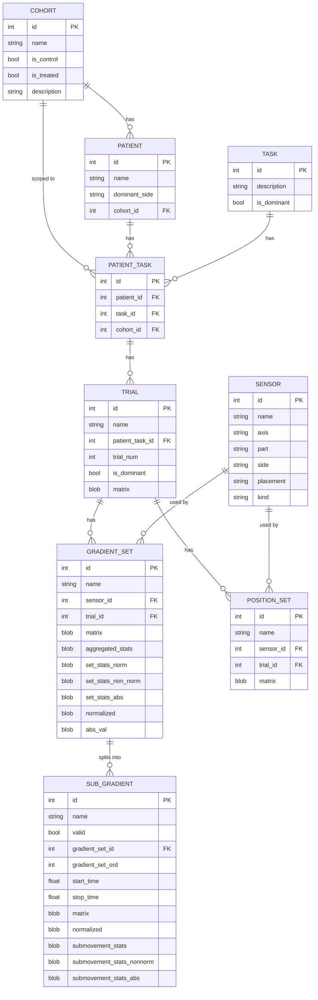

# Motion Analysis — Hand Dominance ML Pipeline

This project ingests wearable sensor data from patients performing Activities of Daily Living (ADLs), builds a SQLite database of motion features, and trains ML classifiers to predict hand dominance.

---

## Project Structure

```
labs/
├── me_importer.py              # Step 2a: ingest raw CSVs → DB (analysis_me cohorts)
├── legacy_importer.py          # Step 2b: ingest raw npy files → DB (CP + healthy control cohorts)
├── legacy_mini_console.py      # Step 3: interactive analysis + training shell
├── migrations/
│   └── legacy_table.py         # DB schema (create/update tables)
├── models/
│   └── legacy_*.py             # ORM models (Patient, Task, Trial, GradientSet, etc.)
├── creation_services/
│   └── old_generator.py        # Parses npy files → creates DB records + features
├── prediction_tools/
│   ├── legacy_predictor.py     # Per-sensor classifier training (GridSearchCV)
│   ├── legacy_multi_predictor.py  # Multi-sensor orchestration + accuracy reporting
│   ├── predictor_score.py      # SHAP values + result storage
│   ├── result_compare.py       # Statistical significance checks
│   ├── time_predictor.py       # Continuous/time-series regression
│   ├── multi_time_predictor.py # Multi-sensor time-series orchestration
│   └── scoliosis_time_predictor.py  # Scoliosis-specific regression variant
├── viewers/
│   ├── plotter.py              # Box plot utility
│   ├── multi_plotter.py        # Multi-series box plots
│   ├── matrix_plotter.py       # Accuracy heatmaps
│   └── shape_rotator.py        # 3D motion trajectory plots
├── exp_motion.py               # Motion sample collection helper
├── exp_motion_sample.py        # Motion sample abstraction
├── exp_motion_sample_trial.py  # Per-trial motion sample
├── motion_filter.py            # Zero-crossing / submovement segmentation
├── legacy_database.py          # SQLite connection singleton
├── progress.py                 # Print summary of patients/tasks/trials in DB
└── raw_data/
    ├── analysis_me/            # Raw CSV data for me_importer (non-motion-analysis cohorts)
    │   └── Group N/
    │       └── SXXX/
    │           ├── Balance/
    │           │   └── Task N_Trial N.csv
    │           └── Gait/
    │               └── Task N_Trial N.csv
    ├── controls_filteredandtrimmed/
    │   └── block/              # Healthy controls (legacy_importer default)
    ├── CP_filteredandtrimmed_2024.07.04/
    │   └── Block/              # CP patients, 07.04 version
    └── CP_filteredTrimmedAligned_2024.07.21/
        └── Block/              # CP patients, 07.21 aligned-coords version
```

> **Note on `legacy_` prefix:** This prefix is a historical artifact — these are the current, active files. There is no non-legacy replacement.

---

## Setup

### 1. Install dependencies

```sh
xcode-select --install        # macOS only, one-time
brew install python3
pip install -r requirements.txt
```

### 2. Place raw data

> **Note:** The `raw_data/` directory is gitignored and is not included in the repository. You must download and place it manually.

There are two raw data sources, each with its own importer:

**`legacy_importer.py`** — ingests motion analysis data (CP patients and healthy controls). Download the shared Google Drive folder [**`raw_data_hc_cp`**](https://drive.google.com/drive/u/0/folders/1nPRV5Jo23Wg9VlJhe8SN7KlXWilMDgOb) and place its three subdirectories directly under `raw_data/`:

```
raw_data/
├── controls_filteredandtrimmed/     ← from Google Drive
├── CP_filteredandtrimmed_2024.07.04/  ← from Google Drive
└── CP_filteredandtrimmed_2024.07.21/  ← from Google Drive
```

Each folder contains `.npy` files. Set `RAW_DATA_FOLDER` at the top of `legacy_importer.py` to point to whichever folder you want to ingest:

| Folder | Cohort | Notes |
|--------|--------|-------|
| `raw_data/controls_filteredandtrimmed/block/` | `healthy_controls` | Healthy controls; default/original dataset |
| `raw_data/CP_filteredandtrimmed_2024.07.04/Block/` | `cp_before` | CP patients, 07.04 version |
| `raw_data/CP_filteredandtrimmed_2024.07.21/Block/` | `cp_before` | CP patients, 07.21 aligned-coords version |

All files use the naming pattern `*_SXXX_Block_dominant/nondominant.npy` — the subject number is encoded in the filename as `SXXX` (e.g. `S008`). The importer assigns the cohort based on whether `cp` appears in the filename (`cp_before`) or not (`healthy_controls`).

**`me_importer.py`** — ingests the `analysis_me` dataset (non-motion-analysis cohorts). Place at:

```
raw_data/analysis_me/
```

The folder structure must match:
```
raw_data/analysis_me/Group 1/S008/Balance/Task 1_Trial 1.csv
raw_data/analysis_me/Group 1/S008/Gait/Task 1_Trial 2.csv
...
```

The path encodes everything: cohort (Group N), patient (SXXX), task type (Balance/Gait), and trial number. The importer reads all of this automatically from the path.

### 3. Initialize the database

Run this once to create `motion_analysis.db`:

```python
from migrations.legacy_table import Table
Table.create_tables()
Table.update_tables()
```

Or just proceed to Step 4 — both importers call `create_tables()` automatically.

### 4. Ingest data

Run whichever importer(s) correspond to your data:

**For `analysis_me` data** (non-motion-analysis cohorts):
```sh
python3 me_importer.py
```

This does the following for every CSV in `raw_data/analysis_me/`:
1. Converts each `.csv` → `.npy` (structured numpy array, headers preserved)
2. Creates `Cohort`, `Patient`, `Task`, and `Trial` records in the DB
3. Reads the sensor columns (accelerometer x/y/z, gyroscope x/y/z, magnitude)
4. Computes velocity (gradient) and splits on zero-crossings into submovements (`SubGradient`)
5. Extracts `tsfresh` features per submovement and stores them in `gradient_set` / `sub_gradient`

**For CP + healthy control data** (motion analysis):
```sh
python3 legacy_importer.py
```

This walks `raw_data/CP_filteredTrimmedAligned_2024.07.21/Block/`, reads `.npy` files directly, and runs the same `OldGenerator` pipeline to create DB records and extract `tsfresh` features.

Both steps are slow — `tsfresh` feature extraction runs for every trial of every patient. Run each once and the results are persisted in the DB.

To check ingestion progress after:

```sh
python3 progress.py
```

### 5. Train and analyze

```sh
python3 -i legacy_mini_console.py
```

The `-i` flag keeps Python open after the script runs, giving you an interactive shell with all models and tools already imported. Example session:

```python
# Find or create a MultiPredictor for block task (task_id=3), cohort 1
mpa = MultiPredictor.where(cohort_id=1, task_id=3)[0]

# View its attributes
mpa.attrs()

# Generate per-sensor Predictor objects (run once per MultiPredictor)
mpa.gen_scores_for_sensor()

# Train all classifiers for all sensors
mpa.train_from()

# View accuracy results
mpa.get_acc()

# View per-classifier accuracy breakdown
mpa.get_all_preds()
```

---

## Data Model

### Entity Relationship Diagram



`PatientTask` is the central join between `Patient`, `Task`, and `Cohort`. A trial belongs to a `PatientTask`, not directly to a patient or task. `GradientSet` and `PositionSet` both hang off `Trial` + `Sensor` — one holds velocity (gradient) data, the other positional data. `SubGradient` records are zero-crossing-segmented slices of a `GradientSet`.

### Navigation Methods

All models inherit from `BaseModel` and share these class-level query methods:

| Method | Returns | Notes |
|--------|---------|-------|
| `Model.get(id)` | instance | Fetch by primary key |
| `Model.where(**kwargs)` | `[instance]` | Filter by column values; accepts lists for `IN` queries |
| `Model.all()` | `[instance]` | All records |
| `Model.last(n)` | `[instance]` | n most recently updated |
| `Model.find_by(column, value)` | instance or `None` | First match |
| `Model.find_or_create(**kwargs)` | instance | Upsert |
| `instance.attrs()` | — | Print all attributes |
| `instance.update(**kwargs)` | — | Persist changes to DB |
| `instance.delete()` | — | Remove record |
| `Model.sort_by(instances, attr)` | `[instance]` | Sort a list by attribute |

#### Cohort
| Method | Returns |
|--------|---------|
| `cohort.get_patient_tasks()` | `[PatientTask]` |
| `cohort.get_trials()` | `[Trial]` |
| `cohort.get_alt_cohort()` | `Cohort` — for analysis_me groups: cycles group_1 → group_2 → group_3 |
| `cohort.is_alt_compare()` | `bool` — `True` for analysis_me cohorts |

#### Patient
| Method | Returns |
|--------|---------|
| `patient.tasks()` | `[Task]` |
| `patient.trials()` | `[Trial]` |
| `patient.patient_task_by_task(task)` | `PatientTask` |
| `patient.add_task(task)` | — creates `PatientTask` join record |
| `patient.remove_task(task)` | — removes `PatientTask` join record |

#### Task
| Method | Returns |
|--------|---------|
| `task.get_patients()` | `[Patient]` |
| `task.trials()` | `[Trial]` |
| `task.get_gradient_sets_for_sensor(sensor, cohort_id=None)` | `[GradientSet]` |
| `task.get_counterpart_task()` | `[Task]` — flips `dominant` ↔ `nondominant` in description |
| `Task.dominant()` | `[Task]` — all tasks with `dominant` but not `nondominant` in description |

#### PatientTask
| Method | Returns |
|--------|---------|
| `pt.get_patient()` | `Patient` |
| `pt.get_trials()` | `[Trial]` |
| `pt.get_gradient_sets_for_sensor(sensor, all=False)` | `[GradientSet]` |
| `pt.combined_gradient_set_stats(sensor, ...)` | stats `Series` — averaged across trials |
| `PatientTask.get(patient, task)` | `PatientTask` |

#### Trial
| Method | Returns |
|--------|---------|
| `trial.get_gradient_sets()` | `[GradientSet]` |
| `trial.patient()` | `Patient` |
| `trial.task()` | `Task` |

#### GradientSet
| Method | Returns |
|--------|---------|
| `gs.mat()` | `pd.Series` — raw velocity time series |
| `gs.sub_gradients()` | `[SubGradient]` |
| `gs.get_task()` | `Task` |
| `gs.get_patient()` | `Patient` |
| `gs.get_patient_task()` | `PatientTask` |
| `gs.get_position_set()` | `PositionSet` |
| `gs.get_sensor_name()` | `str` |
| `gs.get_aggregate_normalized_stats()` | `DataFrame` — mean tsfresh stats per submovement (normalized) |
| `gs.get_aggregate_non_norm_stats(...)` | `DataFrame` — mean tsfresh stats (non-normalized) |
| `gs.get_set_stats_norm()` | `DataFrame` — whole-trial tsfresh features (normalized) |
| `gs.get_set_stats_non_norm()` | `DataFrame` — whole-trial tsfresh features (raw) |
| `gs.get_set_stats_abs()` | `DataFrame` — whole-trial tsfresh features (absolute value) |
| `gs.view_3d()` | — launches 3D trajectory viewer |

#### SubGradient
| Method | Returns |
|--------|---------|
| `sg.gradient_set()` | `GradientSet` |
| `sg.grad_matrix()` | `DataFrame` — velocity slice for this submovement |
| `sg.pos_matrix()` | `DataFrame` — positional slice for this submovement |
| `sg.get_sub_stats(normalized, abs_val)` | tsfresh feature `DataFrame` |

#### Sensor
| Method | Returns |
|--------|---------|
| `sensor.gradient_sets(task)` | `[GradientSet]` |
| `sensor.position_sets(task)` | `[PositionSet]` |

#### PositionSet
| Method | Returns |
|--------|---------|
| `ps.get_task()` | `Task` |
| `ps.get_patient()` | `Patient` |

---

## How training works

1. `MultiPredictor` groups a set of `Predictor` objects — one per sensor location (e.g. `rfin_x`, `rwra_x`, etc.)
2. Each `Predictor` fetches a `tsfresh` feature DataFrame for the dominant and non-dominant hand trials
3. It combines them into a ~50×50 matrix (25 patients × 2 dominance levels, 50 selected features)
4. Classifiers trained: RandomForest, XGBoost, ExtraTrees, DecisionTree, CatBoost
5. Cross-validation: K-Fold by default; LeaveOneOut for small samples
6. Results stored as `PredictorScore` records (accuracy, AUC-ROC, F1, precision, recall, SHAP values)

For left-hand-dominant patients, the importer automatically swaps left/right sensor columns so the model always trains on dominant vs. non-dominant regardless of which side is dominant.

---

## Cohort IDs

| cohort_id | Name | Description | Importer |
|-----------|------|-------------|----------|
| 1 | `healthy_controls` | Healthy controls (CP study) | `legacy_importer.py` |
| 2 | `cp_before` | CP patients | `legacy_importer.py` |
| 3 | `group_2_analysis_me` | Group 2 patients | `me_importer.py` |
| 4 | `group_3_analysis_me` | Group 3 patients | `me_importer.py` |
| 5 | `group_1_analysis_me` | Group 1 patients | `me_importer.py` |

Check your DB with:
```python
Cohort.where()  # returns all cohorts
```

## Task IDs

| task_id | Description |
|---------|-------------|
| 1 | `Rings_nondominant` |
| 2 | `Rings_dominant` |
| 3 | `Block_dominant` |
| 4 | `Block_nondominant` |
| 5 | `Balance02` |
| 6 | `Balance01` |
| 7 | `Gait02` |
| 8 | `Gait01` |

---

## Resetting the database

To start fresh, delete `motion_analysis.db` and re-run Steps 3–4:

```sh
rm motion_analysis.db
python3 me_importer.py
```
